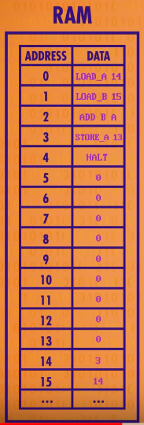
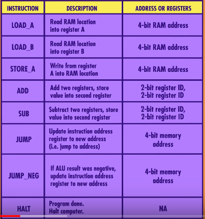

# machine-code-simulator
A simulator for writing machine code or assembler programs.

###The Architecture

The machine described is a hypothetical computer
which has two registers, A and B, and 16 bytes of 
RAM memory. The machine can be programmed using machine
code, which is described in the Instruction Set below.

###The Instruction Set

The instructions listed all have a four-bit value
in binary and a four bit value for the argument. 

By writing a program with these two nibbles as strings
at the beginning of the line, one can write a program in
machine code. This program can then be loaded and 
run using this simulator.

###The OpCodes

0. 0000 0000 NOOP         ; No operation
1. 0001 0000 LOAD_A       ; Read RAM location into Register A
2. 0010 0000 LOAD_B       ; Read RAM location into Register B
4. 0100 0000 ADD          ; Add two registers, store to second register.
5. 0101 0000 SUB          ; Subtract two registers, store to second register.
6. 0110 0000 MULT         ; Multiply two registers, store to second register.
7. 0111 0000 DIV          ; Divide two registers, store to second register.
12. 1100 0000 JUMP         ; Jump program to new RAM location.
13. 1101 0000 JUMP_NEG     ; Jump program if A register negative.
14. 1110 0000 JUMP_OVER    ; Jump program if A register overflowed.
15. 1111 0000 HALT         ; Stop program.
